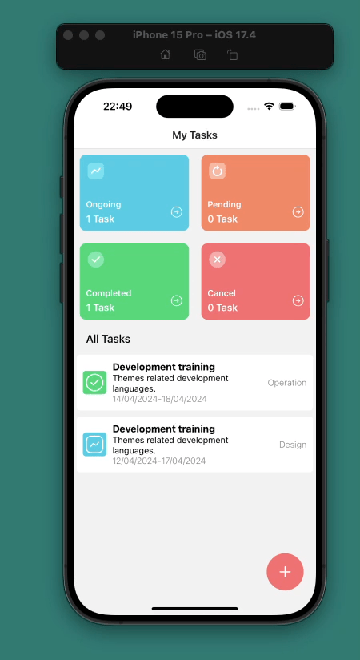

# tasks_app

This is a React Native application for managing tasks. 
It provides features for creating, viewing, updating, and deleting tasks. 
The application includes screens for displaying task details, adding new tasks, and a home screen showing task summaries categorized by status. 

It utilizes various libraries such as:
- `@react-navigation` for navigation, 
- `@ui-kitten/components` for UI components, 
- `AsyncStorage` for data persistence,
- `formik` and `yup` for form validation. 

Icons are managed using `iconsax-react-native`; 
Dates are handled with `moment`. 

Screen gif:

